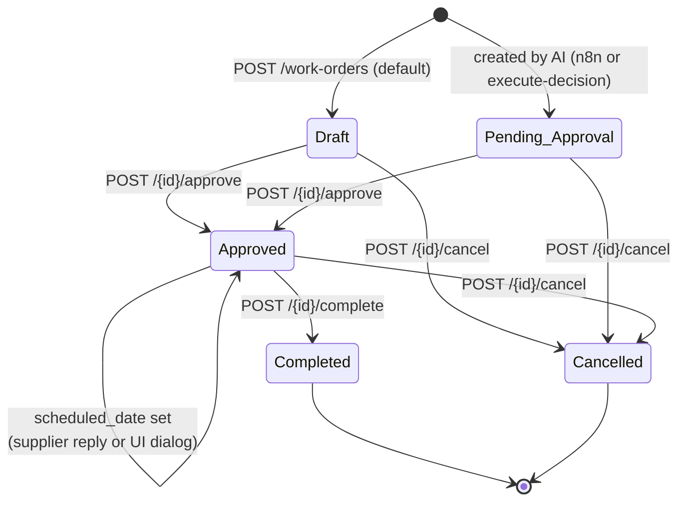
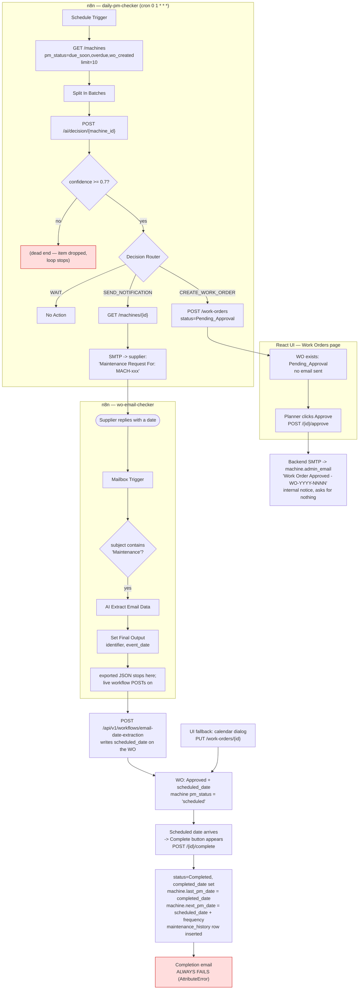
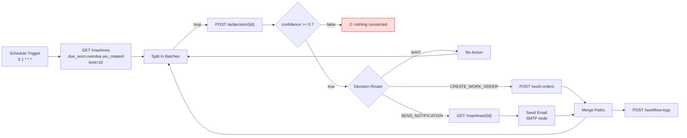
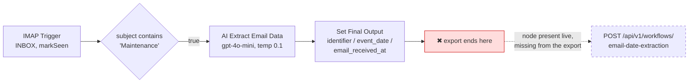

# Work Order Flow — Creation to Close

How a preventive-maintenance work order (WO) moves through the system, which
component drives each transition, and which emails go out at each step.

Covers the FastAPI backend (`AIHarvest_WOApp/backend`), the React UI
(`AIHarvest_WOApp/frontend`) and the three n8n workflows
(`AIHarvest_Workflow/workflows`).

- [1. The pieces](#1-the-pieces)
- [2. Status model](#2-status-model)
- [3. End-to-end flow](#3-end-to-end-flow)
- [4. Stage by stage](#4-stage-by-stage)
- [5. Email notifications — the complete list](#5-email-notifications--the-complete-list)
- [6. The n8n workflows in detail](#6-the-n8n-workflows-in-detail)
- [7. Findings — what is not right](#7-findings--what-is-not-right)

---

## 1. The pieces

| Component | Role in the WO lifecycle |
|---|---|
| **n8n `daily-pm-checker`** | Cron 01:00 daily. Finds machines due for PM, asks the AI, creates WOs, sends the "SEND_NOTIFICATION" email. |
| **n8n `Process Single Machine`** | Same logic as above for one machine, callable as a sub-workflow. Not wired to anything today. |
| **n8n `Email → AI Agent → Date Extraction`** | Watches the mailbox for supplier replies and extracts the promised date. The **exported JSON is incomplete** — see [F2](#f2--the-exported-email-checker-is-missing-its-callback-high). |
| **Backend `/api/v1/ai/*`** | Builds machine context, calls the LLM, stores the decision in `ai_decisions`. Can also execute a decision (create WO / send email). |
| **Backend `/api/v1/work-orders/*`** | The WO state machine: create, approve, complete, cancel. Owns the **admin** approval notice and the **supplier** completion email. |
| **Backend `/api/v1/workflows/email-date-extraction`** | Takes a supplier reply, extracts the date with the LLM, writes `scheduled_date` onto the WO. |
| **React UI** | Machine dashboard, machine detail ("Get AI Decision"), and the Work Orders table (approve / set schedule / complete / cancel). |

---

## 2. Status model

`work_orders.status` is a free-text column constrained only by the Pydantic
schema (`schemas/work_order.py`).



Rules the backend actually enforces:

| Transition | Guard (`routers/work_orders.py`) |
|---|---|
| create | 409 if the machine already has a WO in `Draft`, `Pending_Approval` or `Approved` (`work_orders.py:179`) |
| approve | status must be `Draft` **or** `Pending_Approval` (`work_orders.py:212`) |
| complete | status must be `Approved`; `completed_date` not in the future; not before `scheduled_date` (`work_orders.py:250`) |
| cancel | anything except `Completed` (`work_orders.py:305`) |
| delete | **no guard at all** — hard-deletes any WO in any status (`work_orders.py:335`) |

A machine's dashboard badge (`pm_status`) is derived, not stored
(`services/machine_service.py`), and an open WO outranks the date:

```
Approved WO with scheduled_date  -> "scheduled"
any open WO (Draft/Pending/Approved) -> "wo_created"
else next_pm_date < today        -> "overdue"
else next_pm_date <= today + 30  -> "due_soon"
else                             -> "ok"
```

---

## 3. End-to-end flow

The happy path, with the remaining breaks marked in red.



---

## 4. Stage by stage

### Stage 1 — Detection and AI decision

Two entry points call the same endpoint:

- **n8n `daily-pm-checker`**, 01:00 daily.
- **UI**, "Get AI Decision" on the machine detail page.

`POST /api/v1/ai/decision/{machine_id}` (`routers/ai.py:16`) →
`AIService.make_decision()`:

1. Loads the machine, the last 10 `maintenance_history` rows and every open WO.
2. Sends them to the configured LLM (`LLM_PROVIDER` = openai / claude / gemini)
   with the rule set in `services/llm_providers/base.py`:
   - Approved WO exists → `SEND_NOTIFICATION`
   - Draft / Pending_Approval WO exists → `WAIT`
   - No WO and PM overdue or due ≤ 30 days → `CREATE_WORK_ORDER`
   - Otherwise → `WAIT`
3. Writes a row to `ai_decisions` (decision, priority, confidence, explanation,
   full input context and raw response — this is the audit trail).
4. Flags `requires_review = confidence < CONFIDENCE_THRESHOLD` (default 0.7).

**This endpoint never changes a work order.** It only records a recommendation.

**Email: none.**

### Stage 2 — Work order creation

Three ways a WO can come into existence:

| Path | Initial status | Used today? |
|---|---|---|
| n8n `Create Work Order` node → `POST /work-orders` | `Pending_Approval` | **Yes — the only live path** |
| `POST /ai/decision/{id}/execute` → `_create_work_order_from_decision()` | `Pending_Approval` | No — the UI never calls it |
| Direct `POST /work-orders` (Swagger / script) | `Draft` (schema default) | Manual only; no UI button |

`WorkOrderService.create_work_order()` allocates the number as
`WO-{year}-{seq:04d}`, where `seq` comes from the highest existing number that
year (`work_order_service.py:305`).

**Email: none.** A `Pending_Approval` WO is invisible to the supplier.

### Stage 3 — Approval

UI: Work Orders table → check icon (shown for `Draft` and `Pending_Approval`) →
enter approver name → `POST /work-orders/{id}/approve`.

Backend (`routers/work_orders.py:212`):

1. Sets `status = Approved`, `approved_at = now()`, `approved_by`.
2. Commits — **the approval is committed before the email is attempted**.
3. Calls `_notify(..., "approval")`, which looks the recipient up in
   `_NOTIFY_RECIPIENTS` (approval → `machine.admin_email`, completion →
   `machine.supplier_email`) and then:
   - no machine → `notification_status = "failed"`
   - that address is unset → `"skipped"`
   - email sent → `"sent"`, and `notification_sent` / `notification_sent_at`
     are stamped on the WO
   - SMTP error → `"failed"`
4. Returns the WO with `notification_status` + `notification_detail` attached.
   The UI surfaces a warning toast when it is not `"sent"`
   (`WorkOrderView.jsx:157`).

**📧 Email 1 — Approval notice** (`_build_approval_email`)

- To: **`machine.admin_email`** — an internal notice, not a supplier message
- Subject: `Work Order Approved - WO-YYYY-NNNN`
- Contains: WO number, machine, location, priority, assigned supplier and their
  address, PM frequency, PM due date, scheduled date, approved by/at, notes
- Asks for nothing. It closes with a short "what happens next" note explaining
  that the supplier is contacted separately.

The subject deliberately **omits the word "Maintenance"**. The n8n email checker
forwards any reply whose subject carries it, and `admin_email` and
`supplier_email` may point at the same mailbox — as they do in the seed data —
so an admin notice containing "Maintenance" could be mistaken for the supplier's
date confirmation.

### Stage 4 — Supplier confirms a date

The supplier replies to the n8n **"Maintenance Request For: …"** message →
mailbox trigger → subject filter → AI extracts the date →
`POST /api/v1/workflows/email-date-extraction` → `scheduled_date` written onto
the WO.

Backend validation (`routers/workflow_webhooks.py:84`) — all must pass:

1. Subject matches `WO-\d{4}-\d{3,4}`
2. The WO exists
3. WO status is exactly `Approved` (`workflow_webhooks.py:147`)
4. LLM confidence ≥ 0.7 (`workflow_webhooks.py:165`)
5. A date was returned. Relative wording ("tomorrow", "next Friday", "end of
   the month") is resolved against today; only genuinely vague wording
   ("sometime soon") returns `null`
6. The date is not in the past (`workflow_webhooks.py:75`)

The **exported** workflow JSON is missing the callback node
([F2](#f2--the-exported-email-checker-is-missing-its-callback-high)); the live
workflow has it. `scheduled_date` can also always be set by hand from the
calendar icon on the Work Orders row, which does a plain `PUT /work-orders/{id}`.

**Email: none.** The supplier gets no acknowledgement that their date was
accepted or rejected.

### Stage 5 — Completion

The Complete button only renders when
`status === 'Approved' && hasDateArrived(wo.scheduled_date)`
(`WorkOrderView.jsx:610`). `hasDateArrived(null)` is `false`, so **a WO with no
scheduled date can never be completed from the UI.**

`POST /work-orders/{id}/complete` (`routers/work_orders.py:250`) validates, then
`WorkOrderService.complete_work_order()` (`work_order_service.py:156`) does all
of this in one transaction:

- `status = Completed`, `completed_date = <supplied date>`
- `machine.last_pm_date = completed_date`
- `machine.next_pm_date = (scheduled_date or completed_date) + frequency days`
  — Monthly 30, Bimonthly 60, Quarterly 90, Yearly 365
- inserts a `maintenance_history` row (type `Preventive`, `performed_by =
  machine.assigned_supplier`, linked back to the WO)

Then it attempts the completion email.

**📧 Email 2 — Completion notification** (`_build_completion_email`), to
`machine.supplier_email` — **broken, see
[F1](#f1--the-completion-email-can-never-send-critical).**

### Stage 6 — Cancellation

`POST /work-orders/{id}/cancel` sets `status = Cancelled`. No date fields are
touched, the machine schedule is untouched.

**Email: none** — including when the supplier was already notified.

---

## 5. Email notifications — the complete list

| # | Trigger | To | Sender | Subject | Status |
|---|---|---|---|---|---|
| 1 | WO created | — | — | — | **No email by design** |
| 2 | WO approved | **admin** (`machine.admin_email`) | Backend SMTP | `Work Order Approved - WO-YYYY-NNNN` | ✅ Works |
| 3 | AI says `SEND_NOTIFICATION` | supplier | **n8n** SMTP node | `Maintenance Request For: MACH-xxx` | ✅ This is the message the supplier replies to |
| 4 | Supplier's date accepted | — | — | — | No email (no acknowledgement) |
| 5 | WO completed | supplier | Backend SMTP | `Work Order Completed - WO-YYYY-NNNN` | ❌ **Always fails** ([F1](#f1--the-completion-email-can-never-send-critical)) |
| 6 | WO cancelled | — | — | — | No email |
| 7 | `send_work_order_notification` | supplier | Backend SMTP | `Maintenance Request For: MACH-xxx` | Only reachable via `/ai/decision/{id}/execute`, which nothing calls |

Rows 3 and 7 are deliberately the same subject: they are the same message from
the supplier's point of view, and the n8n email checker matches replies on the
word "Maintenance" in it.

There is a single `notification_sent` boolean on the WO. Approval and completion
both write to it, so it cannot tell you *which* email went out — and the n8n
email (row 3) does not touch it at all, since it bypasses the backend.

---

## 6. The n8n workflows in detail

### `daily_pm_checker.json` — "daily-pm-checker"



Note the ordering: the confidence gate sits **before** the router, so it filters
`WAIT` and `SEND_NOTIFICATION` too, not just WO creation. Its false branch goes
nowhere ([F3](#f3--a-low-confidence-decision-silently-ends-the-whole-run-high)).

Uncommitted local edits raise `limit` from 2 → 10 and relax the gate from
`> 0.9` to `>= 0.7`.

### `check_maintenance_email.json` — "Email → AI Agent → Date Extraction"



The live equivalent (`dyson-wo-email-checker v2`, per `Docs/N8N Flow.pdf`) is
Gmail-based and *does* carry the callback:
`Gmail Trigger → Get many messages → Loop Over Items → Extract Date & Update the
WO table (POST) → If → Send a message / Add label / Mark as read`.

### `process_single_machine.json` — "Process Single Machine"

Sub-workflow (`executeWorkflowTrigger`) with the same decision logic, but it
emails on the CREATE_WORK_ORDER path too (`Maintenance Request For: MACH-xxx`, from
`noreply@aiharvest-pm.com`). Nothing calls it — `daily-pm-checker` has the
logic inlined instead. It is a stale duplicate.

---

## 7. Findings — what is not right

Ordered by severity. Each one is reproducible from the code as it stands.

### F1 — The completion email can never send (critical)

`services/notification_service.py:469`

```python
<p><strong>Completed At:</strong> {work_order.completed_at}</p>
```

`WorkOrder` has **`completed_date`**, not `completed_at` (`models/work_order.py`).
`completed_at` exists only on `WorkflowLog`. Building the body raises
`AttributeError`, which the `try/except` in `send_completion_notification`
swallows and turns into `return False`.

Consequences:

- The supplier is **never** told a WO was completed.
- `notification_sent` is never stamped for completion.
- The UI shows a misleading toast: *"Supplier not notified. The email to X could
  not be sent. Check the SMTP settings and the backend log."* — SMTP is fine;
  the template is broken. Whoever chases this will look in the wrong place.
- The backend log only shows `Error sending completion notification:
  'WorkOrder' object has no attribute 'completed_at'`.

**Fix:** `work_order.completed_date`. (`created_at` in
`_build_work_order_email` is fine — that field does exist.)

### F2 — The exported email checker is missing its callback (high)

`AIHarvest_Workflow/workflows/check_maintenance_email.json`

The **export** stops at the `Set Final Output` node — no HTTP Request node, so
nothing calls `POST /api/v1/workflows/email-date-extraction`. The **live**
workflow does have that step (see the screenshots in `Docs/N8N Flow.pdf`), so
this is an out-of-date export rather than a broken feature.

That distinction matters, because the whole directory is stale in the same way:
the live instance runs `dyson-daily-pm-checker-main`,
`dyson-daily-pm-checker-single` and `dyson-wo-email-checker v2` against
`pm-demo.api.op…`, with Gmail nodes rather than IMAP. **Anyone reading these JSON
files to understand the running system will be misled**, and any fix applied to
them will have no effect until it is also made in the n8n UI.

Two further mismatches in the export, if it is ever revived rather than replaced:

1. `"type": "n8n-nodes-base.aiAgent"` is not a real n8n node type. The AI Agent
   node is `@n8n/n8n-nodes-langchain.agent`, and it needs a connected model
   sub-node. As written the workflow will not import cleanly.
2. The Set node emits `identifier` / `event_date`; the endpoint expects
   `email_subject` / `email_body`. The endpoint runs its **own** LLM extraction
   on the raw body — so the AI Agent step is redundant and should just forward
   subject + body.

**Fix:** re-export the three live workflows over these files, and keep doing it
whenever the live flows change.

### F3 — A low-confidence decision silently ends the whole run (high)

`daily_pm_checker.json`, node `Check Confidence >= 0.7`

The false branch is connected to nothing. Two problems:

1. **Scope.** The gate sits before the router, so it applies to `WAIT` and
   `SEND_NOTIFICATION` as well. It was presumably meant to guard WO creation
   only — `process_single_machine.json` has it in the correct position, after
   the router.
2. **Loop break.** In an n8n `Split In Batches` loop, the item must return to
   the loop node for the next batch to run. A dropped item never reaches
   `Merge Paths`, so the loop stops. **One machine with confidence 0.69 ends
   processing for every machine after it in that run** — with no error and no
   log entry.

### F4 — The supplier is emailed every day until a date is set (high)

`daily_pm_checker.json`, node `Send Email Notification`

This is the supplier-facing message (`Maintenance Request For: MACH-xxx`), and it
fires whenever the AI returns `SEND_NOTIFICATION` — which per the prompt rules
means *"an Approved WO exists"*.

A machine with an Approved WO and no `scheduled_date` has
`pm_status = "wo_created"`, which is in the daily query filter. So it is picked
up **every single day**, the AI returns `SEND_NOTIFICATION` every day, and the
supplier gets the same email every day until they reply with a date. There is no
"already asked" check anywhere in the chain — `notification_sent` would be the
natural guard, but this email bypasses the backend entirely and never sets it.

Two smaller problems in the same node:

- The subject carries the machine ID but **no WO number**, and
  `extract_wo_number_from_subject()` (`routers/workflow_webhooks.py:39`) matches
  on `WO-\d{4}-\d{3,4}`. If the live email checker posts to that endpoint, a
  reply is rejected with *"No work order number found in email subject"*. Worth
  one live test; the fix is to append the WO number to the subject.
- `fromEmail` is `noreply@agenticai-pm.com` here but `noreply@aiharvest-pm.com`
  in `process_single_machine.json`, and the backend uses `SMTP_FROM_EMAIL` —
  three different senders for the same system.

### F5 — A 409 from `Create Work Order` aborts the n8n run (medium)

`POST /work-orders` returns **409** when the machine already has an open WO
(`work_orders.py:179`). The n8n node has no `onError` / `retryOnFail` setting
(only `Log Workflow Results` sets `continueErrorOutput`), so a 409 throws, the
item never reaches `Merge Paths`, and the loop stops — same failure mode as F3.
The AI rules are supposed to prevent this, but an LLM misjudgement or a WO
created between the decision and the POST will kill the run.

### F6 — The UI cannot create a work order or execute an AI decision (medium)

`workOrderService.createWorkOrder` and `aiService.executeDecision` are defined
and never called anywhere in the frontend. "Get AI Decision" on the machine
detail page shows the recommendation in a dialog and stops — there is no
"Execute" or "Create WO from this" action.

So the only live creation path is the 01:00 n8n cron. A planner who sees
`CREATE_WORK_ORDER` on screen at 09:00 has to wait until the next morning, or
call the API by hand.

### F7 — `workflow_logs` records meaningless numbers (medium)

`daily_pm_checker.json`, node `Log Workflow Results`

- `machines_processed`: `$('Get Machines Due for PM').item.json.length` — `item`
  is a single machine object; `.length` is `undefined` → 0.
- `work_orders_created`: `$('Create Work Order') ? 1 : 0` — a node reference is
  always truthy → always 1, even on the WAIT and notification branches.
- `notifications_sent`: same pattern → always 1.
- `status`: hardcoded `"Success"`.
- `execution_time_ms`: hardcoded `0`.
- It hangs off `Merge Paths`, so it fires **once per machine** that took the
  create-WO or notification branch — never once per run, and never at all for a
  run where every machine returned `WAIT`.

The table cannot be used to tell whether a run worked.

### F8 — Next PM date is anchored to the plan, not the work (medium)

`work_order_service.py:184`

```python
base_date = db_wo.scheduled_date if db_wo.scheduled_date else completed_date
next_pm_date = self._calculate_next_pm_date(base_date, machine.pm_frequency)
```

`last_pm_date` gets the actual completion date but `next_pm_date` is computed
from the *scheduled* date. Work done three weeks late still schedules the next
PM as if it had been on time, and the two machine fields disagree.

This looks deliberate (the log line calls it out), but it should be a conscious
decision, not a surprise. Related: the intervals are fixed day counts
(30 / 60 / 90 / 365), so monthly PMs drift against the calendar, and
`"Quarterly"` is in the lookup table but is **not** an accepted `pm_frequency`
value (`schemas/machine.py:11` allows only Monthly / Bimonthly / Yearly).

### F9 — `PUT /work-orders/{id}` can set `status` directly (low)

`WorkOrderUpdate` accepts `status`, so a `PUT` can move a WO to `Completed`
while skipping every side effect the `/complete` endpoint performs: no
`maintenance_history` row, no machine schedule update, no email, no date
validation. The UI only ever sends `scheduled_date`, but the API is open.
`DELETE /work-orders/{id}` is likewise unguarded and hard-deletes.

### F10 — Documentation drift on the webhook path (low)

The real path is `/api/v1/workflows/email-date-extraction` (`main.py`, prefix
`workflows`). Code comments point at two other paths:

- `notification_service.py` → `/workflow/email-date-extraction`
- `machine_service.py` → `/workflow-webhooks/email-date-extraction`

Neither exists. Also `AIHarvest_Workflow/README.md` says machines are processed
"in batches of 5", but the `Split In Batches` node has no `batchSize` set and
defaults to 1.

---

## Suggested order of repair

1. **F1** — one-word fix, unblocks the completion email.
2. **F2** — re-export the three live workflows over the stale JSON, so the repo
   stops describing a system that does not exist.
3. **F4** — add the WO number to the supplier subject, and give the daily
   checker an "already asked" guard so it stops re-sending. Routing the message
   through the backend would fix both at once, since that is where
   `notification_sent` lives.
4. **F3 / F5** — move the confidence gate after the router, connect its false
   branch back to `Split In Batches`, and set `onError: continueRegularOutput`
   on `Create Work Order`.
5. **F6** — wire an "Execute decision" action into the machine detail dialog.
6. **F7 / F8 / F9 / F10** — cleanup.
